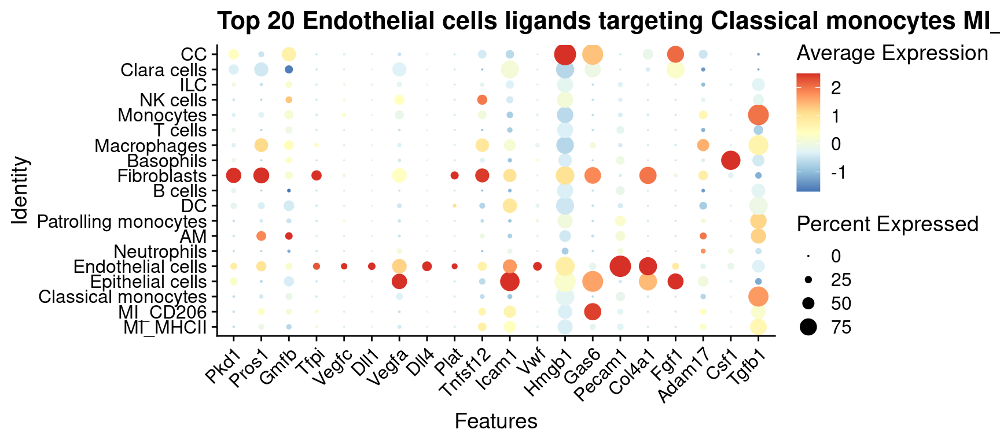
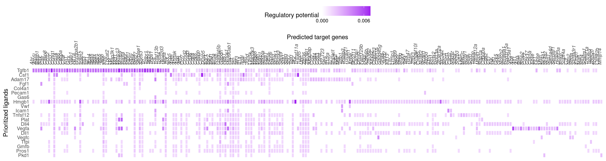
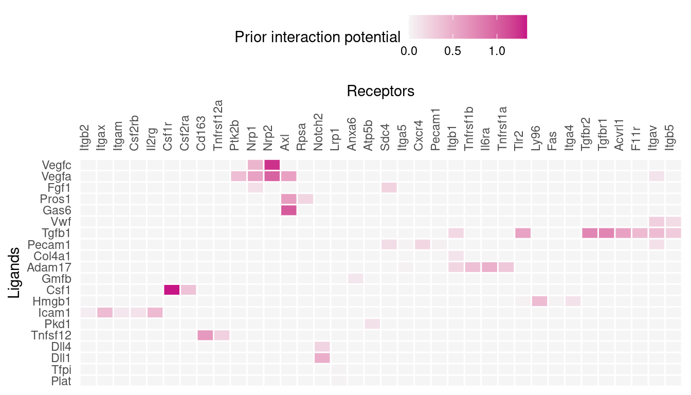
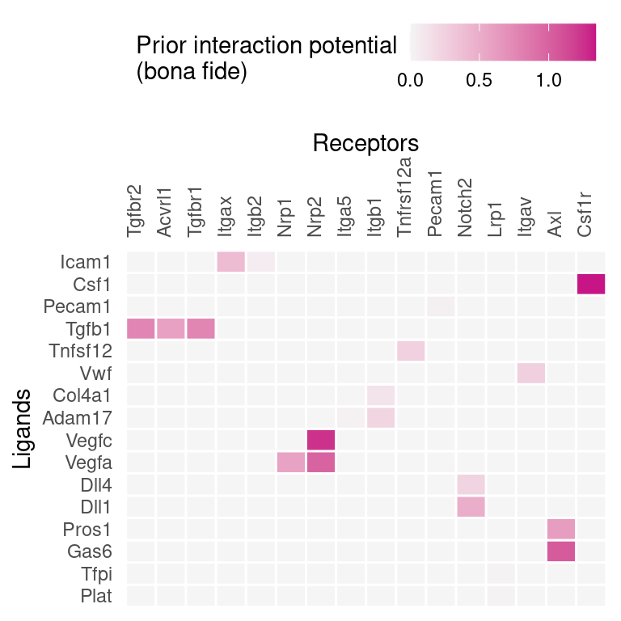
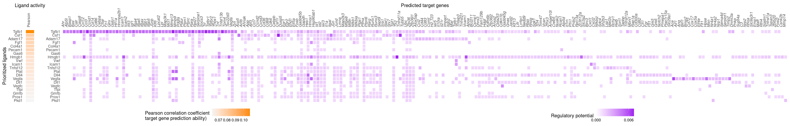

```{r include=FALSE}
knitr::opts_chunk$set(tidy.opts=list(width.cutoff=80),
               tidy=TRUE,
               message = FALSE, 
               warning = FALSE)

sender.cells <- "Endothelial cells"
receiver.cells <- c("Classical monocytes", "MI_CD206", "MI_MHCII")

celltype.from <- "Classical monocytes"
celltype.to <- c("MI_CD206", "MI_MHCII")
```

\newpage


# Description

In this study, we use published scRNAseq data [@Schyns2019] and apply NicheNet [@NicheNet] to predict which ligands expressed by `r sender.cells` and effected in `r receiver.cells` are most likely to have induced the differential expression in the differentiation from `r celltype.from` to `r celltype.to` in steady-state. The reference of the codes used in this analysis is here: https://github.com/saeyslab/nichenetr/blob/master/vignettes/ligand_activity_geneset.md. 

For the genes implicated in the differentiation, we use the genes differentially expressed from `r celltype.from` to `r celltype.to`. The method to calculate the differential expression is here the standard Seurat Wilcoxon test [@SeuratV5]. 

# Prepare NicheNet analysis

## Load required packages

### Load Packages and data:

```{r}
suppressMessages(library(nichenetr))
suppressMessages(library(Seurat))
suppressMessages(library(tidyverse))

so <- readRDS("./all_ss.seuratObject.rds")
Idents(so) <- "cell.type2"
```

Visualize which cell populations are present:
```{r}
so@meta.data$cell.type1 %>% table()
```


Visualize the data to see to main cell types.

```{r fig.width=12, fig.height=10}
DimPlot(so, group.by = "cell.type1", label = TRUE) + ggtitle("Main cell types (UMAP)")
```

Load mouse matrix and tables: 
```{r eval=FALSE}
ligand_target_matrix <- readRDS(file = "/mnt/Data/NicheNet_database/mouse_ligand_target_matrix.Rds")
weighted_networks_lr <- readRDS( file = "/mnt/Data/NicheNet_database/mouse_weighted_networks_lr.Rds")
lr_network <- readRDS(file = "/mnt/Data/NicheNet_database/mouse_lr_network.Rds")
```


# Perform the NicheNet analysis


## 1. Define a “sender/niche” cell population and a “receiver/target” cell population present in your expression data and determine which genes are expressed in both populations

In this case study, the receiver cell population is `r receiver.cells`, whereas the sender cell populations are `r sender.cells`. We will consider a gene to be expressed when it is expressed in at least 10% of cells in one cluster.

```{r eval=FALSE}
source('~/Desktop/velocyto/Script/get_expressed_genes.R')
## receiver
Idents(so) <- "cell.type3"
receiver = receiver.cells
expressed_genes_receiver = get_expressed_genes(receiver, so, pct = 0.10)

background_expressed_genes = expressed_genes_receiver %>% .[. %in% rownames(ligand_target_matrix)]

## sender
sender_celltypes = sender.cells 

list_expressed_genes_sender = sender_celltypes %>% unique() %>% lapply(get_expressed_genes, so, 0.10)
expressed_genes_sender = list_expressed_genes_sender %>% unlist() %>% unique()

```

## 2. Define a gene set of interest: these are the genes in the “receiver/target” cell population that are potentially affected by ligands expressed by interacting cells (e.g. genes differentially expressed upon cell-cell interaction)

Here, the gene set of interest are the genes differentially expressed from `r celltype.from` to `r celltype.to`. The method to calculate the differential expression is here the standard Seurat Wilcoxon test.

DE genes in reveiver cells `r receiver.cells`: 
```{r eval=FALSE}
# seurat_obj_receiver= subset(so, idents = receiver) # we will not compare comditions within one receiver. 
seurat_obj_receiver <- so
# seurat_obj_receiver = SetIdent(seurat_obj_receiver, value = seurat_obj_receiver[["treatment"]])


condition_oi = celltype.to
condition_reference = celltype.from 

DE_table_receiver = FindMarkers(object = seurat_obj_receiver, ident.1 = condition_oi, ident.2 = condition_reference, min.pct = 0.10) %>% rownames_to_column("gene")

geneset_oi = DE_table_receiver %>% filter(p_val_adj <= 0.05 & abs(avg_log2FC) >= 0.25) %>% pull(gene)
geneset_oi = geneset_oi %>% .[. %in% rownames(ligand_target_matrix)]
```


## 3. Define a set of potential ligands: these are ligands that are expressed by the “sender/niche” cell population and bind a (putative) receptor expressed by the “receiver/target” population

Top potential ligands: 
```{r eval=FALSE}
ligands = lr_network %>% pull(from) %>% unique()
receptors = lr_network %>% pull(to) %>% unique()

expressed_ligands = intersect(ligands,expressed_genes_sender)
expressed_receptors = intersect(receptors,expressed_genes_receiver)

potential_ligands = lr_network %>% filter(from %in% expressed_ligands & to %in% expressed_receptors) %>% pull(from) %>% unique()
```


##  4. Perform NicheNet ligand activity analysis: rank the potential ligands based on the presence of their target genes in the gene set of interest (compared to the background set of genes)

The ligand activity table: 
```{r eval=FALSE}
ligand_activities = predict_ligand_activities(geneset = geneset_oi, background_expressed_genes = background_expressed_genes, ligand_target_matrix = ligand_target_matrix, potential_ligands = potential_ligands)

ligand_activities = ligand_activities %>% arrange(-pearson) %>% mutate(rank = rank(desc(pearson)))
```
*The different ligand activity measures (auroc, aupr, pearson correlation coefficient) are a measure for how well a ligand can predict the observed differentially expressed genes compared to the background of expressed genes. In our validation study (the author of the md), we showed that the pearson correlation coefficient between a ligand’s target predictions and the observed transcriptional response was the most informative measure to define ligand activity. Therefore, NicheNet ranks the ligands based on their pearson correlation coefficient. *

The number of top-ranked ligands that are further used to predict active target genes and construct an active ligand-receptor network is here 20.

```{r eval=FALSE}
best_upstream_ligands = ligand_activities %>% top_n(20, pearson) %>% arrange(-pearson) %>% pull(test_ligand) %>% unique()
```

These ligands are expressed by one or more of the input sender cells. To see which cell population expresses which of these top-ranked ligands:

```{r eval=FALSE}
DotPlot(so, features = best_upstream_ligands %>% rev(), cols = "RdYlBu") + RotatedAxis() + ggtitle(paste("Top 20", paste(sender_celltypes, collapse = " "), "ligands targeting", paste(receiver.cells, collapse = " ")))
```



## 5. Infer receptors and top-predicted target genes of ligands that are top-ranked in the ligand activity analysis

### Active target gene inference

```{r eval=FALSE}
active_ligand_target_links_df = best_upstream_ligands %>% lapply(get_weighted_ligand_target_links,geneset = geneset_oi, ligand_target_matrix = ligand_target_matrix, n = 200) %>% bind_rows() %>% drop_na()

active_ligand_target_links = prepare_ligand_target_visualization(ligand_target_df = active_ligand_target_links_df, ligand_target_matrix = ligand_target_matrix, cutoff = 0.33)

order_ligands = intersect(best_upstream_ligands, colnames(active_ligand_target_links)) %>% rev() %>% make.names()
order_targets = active_ligand_target_links_df$target %>% unique() %>% intersect(rownames(active_ligand_target_links)) %>% make.names()
rownames(active_ligand_target_links) = rownames(active_ligand_target_links) %>% make.names() # make.names() for heatmap visualization of genes like H2-T23
colnames(active_ligand_target_links) = colnames(active_ligand_target_links) %>% make.names() # make.names() for heatmap visualization of genes like H2-T23

vis_ligand_target = active_ligand_target_links[order_targets,order_ligands] %>% t()
```


```{r eval=FALSE}
p_ligand_target_network = vis_ligand_target %>% make_heatmap_ggplot("Prioritized ligands","Predicted target genes", color = "purple",legend_position = "top", x_axis_position = "top",legend_title = "Regulatory potential")  + theme(axis.text.x = element_text(face = "italic")) + scale_fill_gradient2(low = "whitesmoke",  high = "purple", breaks = c(0,0.006,0.012))
p_ligand_target_network
```




### Receptors of top-ranked ligands

```{r eval=FALSE}
lr_network_top = lr_network %>% filter(from %in% best_upstream_ligands & to %in% expressed_receptors) %>% distinct(from,to)
best_upstream_receptors = lr_network_top %>% pull(to) %>% unique()

lr_network_top_df_large = weighted_networks_lr %>% filter(from %in% best_upstream_ligands & to %in% best_upstream_receptors)

lr_network_top_df = lr_network_top_df_large %>% spread("from","weight",fill = 0)
lr_network_top_matrix = lr_network_top_df %>% select(-to) %>% as.matrix() %>% magrittr::set_rownames(lr_network_top_df$to)

dist_receptors = dist(lr_network_top_matrix, method = "binary")
hclust_receptors = hclust(dist_receptors, method = "ward.D2")
order_receptors = hclust_receptors$labels[hclust_receptors$order]

dist_ligands = dist(lr_network_top_matrix %>% t(), method = "binary")
hclust_ligands = hclust(dist_ligands, method = "ward.D2")
order_ligands_receptor = hclust_ligands$labels[hclust_ligands$order]

order_receptors = order_receptors %>% intersect(rownames(lr_network_top_matrix))
order_ligands_receptor = order_ligands_receptor %>% intersect(colnames(lr_network_top_matrix))

vis_ligand_receptor_network = lr_network_top_matrix[order_receptors, order_ligands_receptor]
rownames(vis_ligand_receptor_network) = order_receptors %>% make.names()
colnames(vis_ligand_receptor_network) = order_ligands_receptor %>% make.names()

p_ligand_receptor_network = vis_ligand_receptor_network %>% t() %>% make_heatmap_ggplot("Ligands","Receptors", color = "mediumvioletred", x_axis_position = "top",legend_title = "Prior interaction potential")
p_ligand_receptor_network

```




### Receptors of top-ranked ligands, but after considering only bona fide ligand-receptor interactions documented in literature and publicly available databases

```{r eval=FALSE}
lr_network_strict = lr_network %>% filter(database != "ppi_prediction_go" & database != "ppi_prediction") # remove these 2 predictions
ligands_bona_fide = lr_network_strict %>% pull(from) %>% unique()
receptors_bona_fide = lr_network_strict %>% pull(to) %>% unique()

lr_network_top_df_large_strict = lr_network_top_df_large %>% distinct(from,to) %>% inner_join(lr_network_strict, by = c("from","to")) %>% distinct(from,to)
lr_network_top_df_large_strict = lr_network_top_df_large_strict %>% inner_join(lr_network_top_df_large, by = c("from","to"))

lr_network_top_df_strict = lr_network_top_df_large_strict %>% spread("from","weight",fill = 0)
lr_network_top_matrix_strict = lr_network_top_df_strict %>% select(-to) %>% as.matrix() %>% magrittr::set_rownames(lr_network_top_df_strict$to)

dist_receptors = dist(lr_network_top_matrix_strict, method = "binary")
hclust_receptors = hclust(dist_receptors, method = "ward.D2")
order_receptors = hclust_receptors$labels[hclust_receptors$order]

dist_ligands = dist(lr_network_top_matrix_strict %>% t(), method = "binary")
hclust_ligands = hclust(dist_ligands, method = "ward.D2")
order_ligands_receptor = hclust_ligands$labels[hclust_ligands$order]

order_receptors = order_receptors %>% intersect(rownames(lr_network_top_matrix_strict))
order_ligands_receptor = order_ligands_receptor %>% intersect(colnames(lr_network_top_matrix_strict))

vis_ligand_receptor_network_strict = lr_network_top_matrix_strict[order_receptors, order_ligands_receptor]
rownames(vis_ligand_receptor_network_strict) = order_receptors %>% make.names()
colnames(vis_ligand_receptor_network_strict) = order_ligands_receptor %>% make.names()

p_ligand_receptor_network_strict = vis_ligand_receptor_network_strict %>% t() %>% make_heatmap_ggplot("Ligands","Receptors", color = "mediumvioletred", x_axis_position = "top",legend_title = "Prior interaction potential\n(bona fide)")
p_ligand_receptor_network_strict

```




## 6) Summary visualizations of the NicheNet analysis

```{r eval=FALSE}
# combined heatmap: overlay ligand activities with target genesRemarks

ligand_pearson_matrix = ligand_activities %>% select(pearson) %>% as.matrix() %>% magrittr::set_rownames(ligand_activities$test_ligand)

rownames(ligand_pearson_matrix) = rownames(ligand_pearson_matrix) %>% make.names()
colnames(ligand_pearson_matrix) = colnames(ligand_pearson_matrix) %>% make.names()

vis_ligand_pearson = ligand_pearson_matrix[order_ligands, ] %>% as.matrix(ncol = 1) %>% magrittr::set_colnames("Pearson")
p_ligand_pearson = vis_ligand_pearson %>% make_heatmap_ggplot("Prioritized ligands","Ligand activity", color = "darkorange",legend_position = "top", x_axis_position = "top", legend_title = "Pearson correlation coefficient\ntarget gene prediction ability)") + theme(legend.text = element_text(size = 9))

figures_without_legend = cowplot::plot_grid(p_ligand_pearson + theme(legend.position = "none", axis.ticks = element_blank()) + theme(axis.title.x = element_text()),
    p_ligand_target_network + theme(legend.position = "none", axis.ticks = element_blank()) + ylab(""),
    align = "hv",
    nrow = 1,
    rel_widths = c(ncol(vis_ligand_pearson)+10, ncol(vis_ligand_target)))

legends = cowplot::plot_grid(
    ggpubr::as_ggplot(ggpubr::get_legend(p_ligand_pearson)),
    ggpubr::as_ggplot(ggpubr::get_legend(p_ligand_target_network)),
    nrow = 1,
    align = "h")

combined_plot = cowplot::plot_grid(figures_without_legend, legends, rel_heights = c(10,2), nrow = 2, align = "hv")
combined_plot

```




# Session information

R sesssion: 

```{r}
sessionInfo()
```

# References

